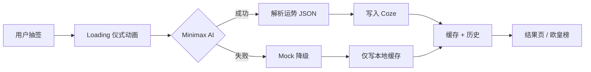

# 今日赛博运势（Cyber Fortune）

AI 驱动的赛博朋克娱乐运势应用。用 Minimax 大模型生成「打工人今日运势」，支持截图分享与社交传播。产品定位为娱乐工具，不是算命或黄历。

本项目同时包含 **微信小程序** 与 **Web 版** 两套前端，共享业务逻辑，并通过 **Netlify Functions** 统一代理 Coze 数据库与 Minimax API。

---

## 功能概览

| 模块 | 说明 |
|------|------|
| 站点主页 | `/` 统一入口，分别进入运势、解压游戏或 AI 带货短剧 |
| 每日抽签 | 每天限抽一次正式签，AI 生成等级（N/R/SR/SSR）、幸运值、摸鱼指数、老板风险等 |
| 运势结果 | 赛博风格结果页，含 Buff、避雷、关键词，支持截图分享 |
| 历史记录 | 近 30 天运势，云端 + 本地双写合并展示 |
| 欧皇榜 | 当日正式签排行榜，领奖台、统计条、自己条目高亮 |
| 个人中心 | 昵称/头像、SSR 统计、签到积分等 |
| 赛博解压 | `/game.html` 闯关砸碎小游戏（清目标进下一关） |
| AI 带货短剧 | `/short-drama.html` 上传商品图，Coze 生成视频提示词，Seedance 生成竖屏短剧 |

---

## 技术栈

- **小程序前端**：微信原生（WXML / WXSS / JavaScript ES6），自定义 TabBar，Skyline 渲染
- **Web 前端**：原生 ES Module SPA，赛博朋克 Glassmorphism UI
- **AI 生成**：Minimax-M3（`text/chatcompletion_v2`）
- **云端存储**：Coze 扣子数据库（`fortune_records`、`users`）
- **API 代理**：Netlify Functions（Node.js 20 + esbuild）
- **本地缓存**：`wx.storage` / `localStorage`，云端失败时自动降级

---

## 项目结构

```
wxcpyapp/
├── miniprogram/              # 微信小程序
│   ├── pages/                # welcome / home / result / history / ranking / profile
│   ├── services/             # fortune.js、coze.js、Minimax.js
│   ├── utils/                # storage、proxy、animation、loading-ritual 等
│   ├── config/               # index.example.js → 复制为 index.js
│   └── custom-tab-bar/       # 自定义底部导航
├── public/                   # Web 版静态站点
│   ├── index.html            # 站点主页（运势 / 游戏 / 短剧入口）
│   ├── fortune.html          # 今日赛博运势 SPA
│   ├── game.html             # 赛博解压小游戏
│   ├── short-drama.html      # AI 带货短剧
│   ├── css/                  # hub.css / app.css / game.css
│   └── js/                   # 与小程序逻辑对齐的 ES Module + 游戏脚本
├── netlify/
│   └── functions/            # coze / minimax / ranking API 代理
├── tests/                    # API 与 Web 端自动化测试脚本
├── docs/                     # 数据库建表、测试报告、变更记录
├── netlify.toml              # 部署与 /api/* 路由配置
├── project.config.json       # 微信开发者工具项目配置
└── 今日赛博运势_PRD_Grok.md   # 产品需求文档
```

---

## 快速开始

### 环境要求

- [微信开发者工具](https://developers.weixin.qq.com/miniprogram/dev/devtools/download.html)
- Node.js 20+
- [Netlify CLI](https://docs.netlify.com/cli/get-started/)（本地 API 代理开发）
- Coze API Token + 数据库 ID
- Minimax API Key

### 1. 克隆并安装依赖

```bash
cd wxcpyapp
npm install
```

### 2. 配置环境变量

复制 `.env.example` 为 `.env`，填入真实密钥：

```bash
cp .env.example .env
```

| 变量 | 说明 |
|------|------|
| `COZE_TOKEN` | Coze 个人访问令牌 |
| `COZE_FORTUNE_DB` | `fortune_records` 表的 database_id |
| `COZE_USERS_DB` | `users` 表的 database_id |
| `MINIMAX_API_KEY` | Minimax API 密钥 |
| `MINIMAX_MODEL` | 默认 `Minimax-M3` |
| `COZE_SHORT_DRAMA_WORKFLOW_ID` | AI 带货短剧提示词工作流 ID |
| `ARK_API_KEY` | 火山方舟 Ark API Key，用于 Seedance 视频生成 |
| `ARK_BASE_URL` | 默认 `https://ark.cn-beijing.volces.com/api/v3` |
| `SEEDANCE_MODEL` | 默认 `doubao-seedance-1-5-pro-251215` |
| `API_SECRET` | 可选，设置后请求需带 `X-API-Key` 头 |

Coze 数据库建表步骤见 [docs/COZE_DATABASE_SETUP.md](docs/COZE_DATABASE_SETUP.md)。

### 3. 配置小程序

```bash
cp miniprogram/config/index.example.js miniprogram/config/index.js
```

编辑 `miniprogram/config/index.js`：

- 部署 Netlify 后，将 `proxyBaseUrl` 设为 `https://your-site.netlify.app/api`
- 若设置了 `API_SECRET`，同步填入 `apiSecret`
- 也可留空 `proxyBaseUrl` 直连 Coze/Minimax（需在微信后台配置合法域名）

### 4. 本地开发

**Web 版 + API 代理：**

```bash
npm run dev
# 主页 http://localhost:8888/
# 运势 http://localhost:8888/fortune.html
# 游戏 http://localhost:8888/game.html
# 短剧 http://localhost:8888/short-drama.html
```

**微信小程序：**

1. 用微信开发者工具打开项目根目录
2. 确认 `miniprogramRoot` 指向 `miniprogram/`
3. 开发阶段可在「详情 → 本地设置」勾选「不校验合法域名」

---

## API 路由

Netlify 将 `/api/*` 转发至 Functions：

| 路径 | 方法 | 说明 |
|------|------|------|
| `/api/coze` | POST | Coze 数据库增删查改代理 |
| `/api/minimax` | POST | Minimax 对话补全代理 |
| `/api/ranking` | GET/POST | 欧皇榜聚合查询 |
| `/api/short-drama` | POST/GET | AI 带货短剧创建任务与状态查询 |

请求示例（Coze 查询）：

```json
POST /api/coze
{
  "action": "query",
  "dbKey": "fortuneRecords",
  "payload": { "pageNum": 1, "pageSize": 20 }
}
```

---

## 部署

### Netlify（Web + API）

1. 将仓库连接至 Netlify
2. 构建设置使用默认 `netlify.toml`（发布目录 `public`，Functions 目录 `netlify/functions`）
3. 在 Netlify Dashboard → Environment variables 配置 `.env` 中的变量
4. 将站点 URL 写入小程序 `proxyBaseUrl`

### 微信小程序

1. 在微信公众平台配置 request 合法域名（Netlify 域名或 Coze/Minimax 域名）
2. 确认 `project.config.json` 中的 `appid`
3. 开发者工具上传代码 → 提交审核 → 发布

---

## 测试

```powershell
# API 与静态文件检查
.\tests\api-test.ps1
.\tests\static-check.ps1

# Web 端 E2E
.\tests\web-test.ps1
```

测试报告见 [docs/TEST_REPORT.md](docs/TEST_REPORT.md)。

---

## 核心业务流程



- **正式签**：每日限一次，`is_official = 1`，计入排行榜
- **分数机制**：主路径由 Minimax-M3 生成 0–100 幸运值；AI 失败时按等级区间随机 Mock
- **数据合并**：历史页与欧皇榜均合并云端记录与本地缓存，保证离线/云端失败时仍可用

---

## 设计规范

- 视觉：Cyberpunk + Glassmorphism + 暗黑模式
- 动画：60 FPS 粒子、数字滚动、抽签仪式 Loading
- 参考 PRD：[今日赛博运势_PRD_Grok.md](今日赛博运势_PRD_Grok.md)

---

## 相关文档

| 文档 | 内容 |
|------|------|
| [docs/COZE_DATABASE_SETUP.md](docs/COZE_DATABASE_SETUP.md) | Coze 数据库建表与字段说明 |
| [docs/CHANGELOG.md](docs/CHANGELOG.md) | 开发变更记录 |
| [docs/TEST_REPORT.md](docs/TEST_REPORT.md) | 功能与 API 测试报告 |
| [今日赛博运势_PRD_Grok.md](今日赛博运势_PRD_Grok.md) | 完整产品需求 |

---

## 许可证

本项目尚未指定开源许可证，使用前请与项目维护者确认。
